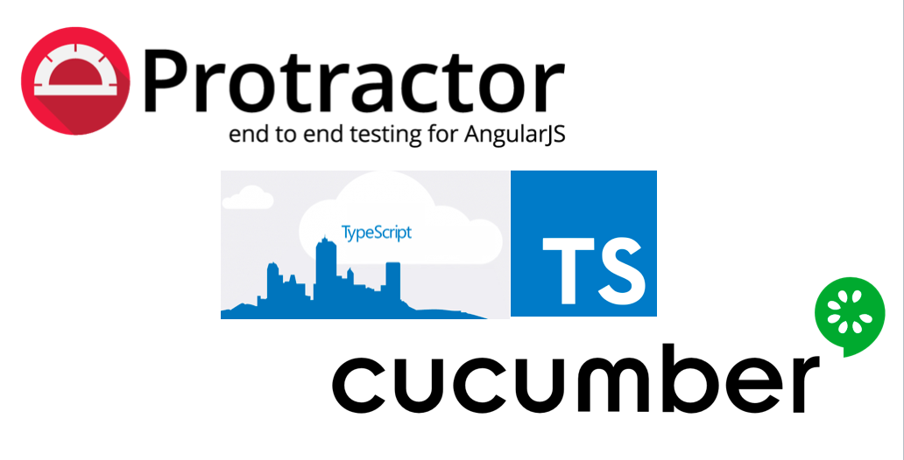

<p> <strong><center><h1>SIEMENS-SMETS2 Mobility Workflow Process</h1></center></strong>
<p align="center">
<!---->
</p>

<p align="center">
   <i><strong>This project automates the SMETS2 workflows using protractor-cucumber-typescript framework.
</strong></i>
<p>

### Protractor-Cucumber-TypeScript Setup Guide   

### Features
* All scripts written with > Typescript2.0 & Cucumber2.0.
* Neat folder structures with transpiled js files in separate output folder.
* Page Object design pattern implementation.
* Extensive hooks implemented for BeforeLaunch, OnPrepare etc.
* Screenshots attached to failure feature scenarios.
* Reports generated at the end of execution with error messages for failed steps
* Parallel execution possible with the multicapabilities feature.

### To Get Started

#### Pre-requisites
1.Install NodeJS
https://nodejs.org/en/download/

2.Chrome browser installed.

3.Text Editor(Optional) installed-->Sublime/Visual Studio Code/Brackets.

4.Install Java

#### Setup Scripts
* Clone the repository into a folder
* Go inside the folder and run following command from terminal/command prompt
```
npm install 
```
* All the dependencies from package.json and ambient typings would be installed in node_modules folder.

#### Run Scripts

* First step is to fire up the selenium server which could be done in many ways,  **webdriver-manager** proves very handy for this.The below command should download the **chrome & gecko driver** binaries locally for you!
```
npm run webdriver-update
``` 
* Then you should start your selenium server!
```
npm run webdriver-start
```

* Run the below commands to install dependencies used within the project 
```
npm install protractor-multiple-cucumber-html-reporter-plugin
npm install unlink
```

* Run the below commands to install API dependencies used within the project 
```
npm install easy-soap-request
npm install xmlhttprequest
```

* The below command would create an output folder named 'typeScript' and transpile the .ts files to .js.
```
npm run build
```

* Uncomment the required Spec on the config file based on the batch of testcases to be run.
```
AbortGasRisk-EXCH cases: "../../features/Abort/Abort_GasRisk/EXCHANGE/*.feature",
AbortGasRisk-FLTY cases: "../../features/Abort/Abort_GasRisk/FAULTY_SMETS2/*.feature",
AbortGasRisk-FALTYTRAD cases: "../../features/Abort/Abort_GasRisk/FAULTY_TRAD/*.feature",
AbortGasRisk-INST cases: "../../features/Abort/Abort_GasRisk/INSTALLATION/*.feature",
AbortGasRisk-REMOVE cases: "../../features/Abort/Abort_GasRisk/REMOVE/*.feature",
AbortInitialRisk-EXCH cases: "../../features/Abort/Abort_InitialRisk/EXCHANGE/*.feature",
AbortInitialRisk-FLTY cases: "../../features/Abort/Abort_InitialRisk/FAULTY_SMETS2/*.feature",
AbortInitialRisk-FLTYTRAD cases: "../../features/Abort/Abort_InitialRisk/FAULTY_TRAD/*.feature",
AbortInitialRisk-INST cases: "../../features/Abort/Abort_InitialRisk/INSTALLATION/*.feature",
AbortInitialRisk-REMOVE cases: "../../features/Abort/Abort_InitialRisk/REMOVE/*.feature",
AbortContactMade-EXCH cases: "../../features/Abort/AbortContactMade/EXCHANGE/*.feature",
AbortContactMade-FLTY cases: "../../features/Abort/AbortContactMade/FAULTY_SMETS2/*.feature",
AbortContactMade-FLTYTRAD cases: "../../features/Abort/AbortContactMade/FAULTY_TRAD/*.feature",
AbortContactMade-INST cases: "../../features/Abort/AbortContactMade/INSTALLATION/*.feature",
AbortContactMade-REMOVE cases: "../../features/Abort/AbortContactMade/REMOVE/*.feature",
AbortNoAccessSuspend-EXCH cases: "../../features/Abort/AbortNoAccessSuspend/EXCHANGE/*.feature",
AbortNoAccessSuspend-FLTY cases: "../../features/Abort/AbortNoAccessSuspend/FAULTY_SMETS2/*.feature",
AbortNoAccessSuspend-FLTYTRAD cases: "../../features/Abort/AbortNoAccessSuspend/FAULTY_TRAD/*.feature",
AbortNoAccessSuspend-INST cases: "../../features/Abort/AbortNoAccessSuspend/INSTALLATION/*.feature",
AbortNoAccessSuspend-REMOVE cases: "../../features/Abort/AbortNoAccessSuspend/REMOVE/*.feature",
AbortElecRisk-EXCH cases: "../../features/Abort/Abort_ElecRisk/EXCHANGE/*.feature",
AbortElecRisk-FLTY cases: "../../features/Abort/Abort_ElecRisk/FAULTY_SMETS2/*.feature",
AbortElecRisk-FLTYTRAD cases: "../../features/Abort/Abort_ElecRisk/FAULTY_TRAD/*.feature",
AbortElecRisk-INST cases: "../../features/Abort/Abort_ElecRisk/INSTALLATION/*.feature",
AbortElecRisk-REMOVE cases: "../../features/Abort/Abort_ElecRisk/REMOVE/*.feature",
InstallAndLeave-EXCH cases: "../../features/Abort/InstallAndLeave/EXCHANGE/*.feature",
InstallAndLeave-FLTY cases: "../../features/Abort/InstallAndLeave/FAULTY_SMETS2/*.feature",
InstallAndLeave-FLTYTRAD cases: "../../features/Abort/InstallAndLeave/FAULTY_TRAD/*.feature",
InstallAndLeave-INST cases: "../../features/Abort/InstallAndLeave/INSTALLATION/*.feature",
EXCH-E2E cases:  "../../features/EXCHANGE/*.feature",
FLTY-E2E cases:  "../../features/FAULTY_SMETS2/*.feature",
FLTYTRAD-E2E cases: "../../features/FAULTY_TRAD/*.feature",
INST-E2E cases:  "../../features/INSTALLATION/*.feature",
REMOVE-E2E cases: "../../features/REMOVE/*.feature",
```

* Now just run the test command which launches the Chrome Browser and runs the scripts.
```
npm run test
```


#### Writing Features
```
Feature: To search typescript in google
@TypeScriptScenario

  Scenario: Typescript Google Search
    Given I am on google page
    When I type "Typescript"
    Then I click on search button
    Then I clear the search text
```
#### Writing Step Definitions
    
```
import { browser } from "protractor";
import { SearchPageObject } from "../pages/searchPage";
const { Given } = require("cucumber");
const chai = require("chai").use(require("chai-as-promised"));
const expect = chai.expect;

const search: SearchPageObject = new SearchPageObject();

Given(/^I am on google page$/, async () => {
    await expect(browser.getTitle()).to.eventually.equal("Google");
});
```

#### Writing Page Objects
```
import { $ } from "protractor";

export class SearchPageObject {
    public searchTextBox: any;
    public searchButton: any;

    constructor() {
        this.searchTextBox = $("#lst-ib");
        this.searchButton = $("input[value='Google Search']");
    }
}
```
#### Cucumber Hooks
Following method takes screenshot on failure of each scenario
```
After(async function(scenario) {
    if (scenario.result.status === Status.FAILED) {
        // screenShot is a base-64 encoded PNG
         const screenShot = await browser.takeScreenshot();
         this.attach(screenShot, "image/png");
    }
});
```
#### CucumberOpts Tags
Following configuration shows to call specific tags from feature files
```
cucumberOpts: {
    compiler: "ts:ts-node/register",
    format: "json:./reports/json/cucumber_report.json",
    require: ["../../stepdefinitions/*.ts", "../../support/*.ts"],
    strict: true,
    tags: "@TypeScriptScenario or @CucumberScenario or @ProtractorScenario",
},
```
#### HTML Reports
Currently this project has been integrated with [protractor-multiple-cucumber-html-reporter-plugin], which generates execution reports in the `reports` folder when you run `npm run test`.

index.html file within the reports folder contains the overall execution status and the number of scenarios passed/failed. Each scenario's status can be viewed in detail using the corresponding Workorder link on the page.

They can be customized according to user's specific needs.


 


#### Contributors
* Aparna Das 
* Jansi Victor
* Supriya Harikumar
* Priya Gangadharan
* Mark Raphael

#### License
```   
MIT License
Copyright (c) 2019
```
